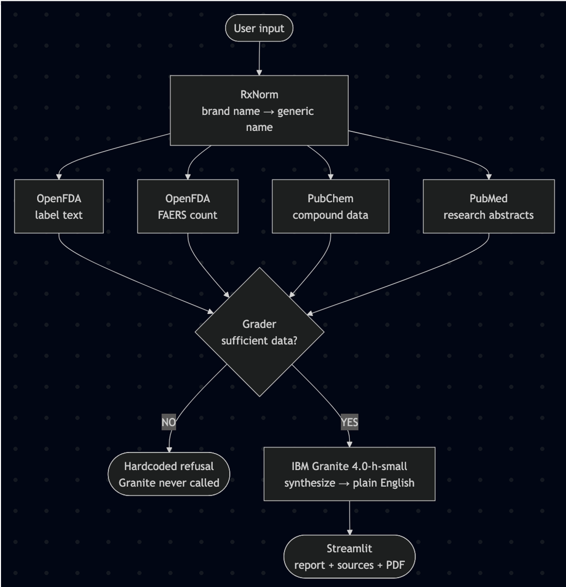

# MedCheck
Created by @jklopson and @martin-jack22
for the IBM Granite Hackathon at UVM.

##### Agent overview
MedCheck most closely resembles a ToolRAG pipeline, drawing data from external sources which inform the Granite model along with a system prompt to generate data. We also implemented a failsafe in the case that not enough data is generated by each of the 5 tools that we implemented: a hardcoded python script that ensures the model will not act on a lack of actual data.

##### Data Sources
RxNorm: resolves brand names to generic names (ex: tylenol -> acetaminophen)
OpenFDA: FDA approved interactions and adverse event counts
PubChem: NIH compound data, covers drugs outside of FDA regulation
PubMed: peer reviewed research abstracts via NCBI

##### Agent flow

##### DISCLAIMER
For informational purposes only. Not a substitute for professional medical advice. Always consult your pharmacist or doctor.